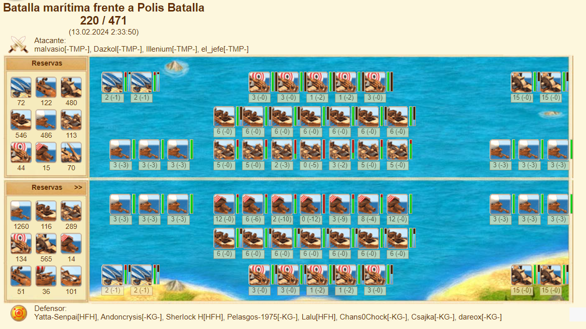
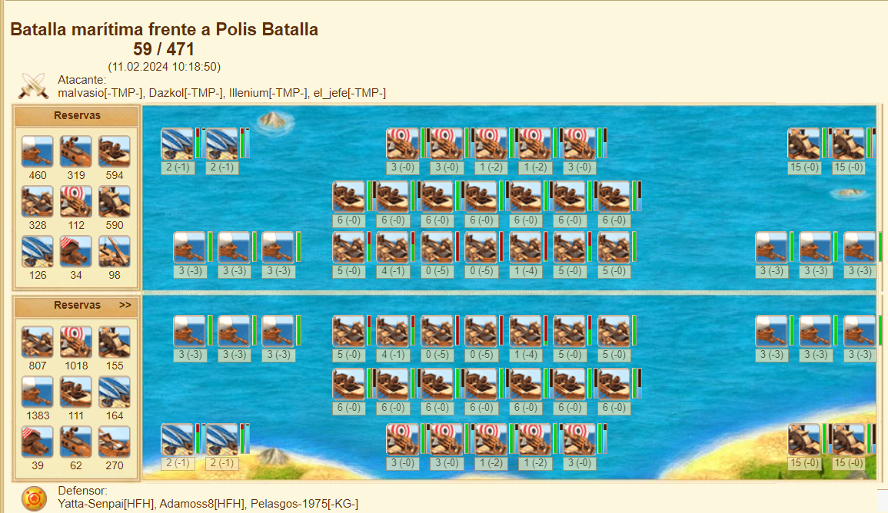

full fires,morts,rockets vs full steams,morts,rockets; fully forged vs fully forged
 

full fires,morts,rockets vs full steams,morts,rockets; fires not forged vs fully forged
 

full steams,morts,rockets vs full steams,morts,rockets; steams not forged vs fully forged
 

6 fires-1 steams,morts,rockets vs full steams,morts,rockets; fully forged vs fully forged
 

5 fires-2 steams,morts,rockets vs full steams,morts,rockets; fully forged vs fully forged
 

4 fires-3 steams,morts,rockets vs full steams,morts,rockets; fully forged vs fully forged
 

**3 fires-4 steams,morts,rockets vs 3 fires-4 steams,morts,rockets; fully forged vs fully forged**
 

full steams,morts,rockets vs 3 fires-4 steams,morts,rockets; fully forged vs fully forged
 

full steams,morts,rockets vs 3 fires-4 steams,morts,4 dives-1 rockets; fully forged vs fully forged
 

full fires,morts,rockets vs full steams,no morts,rockets; fires not forged vs fully forged
 

